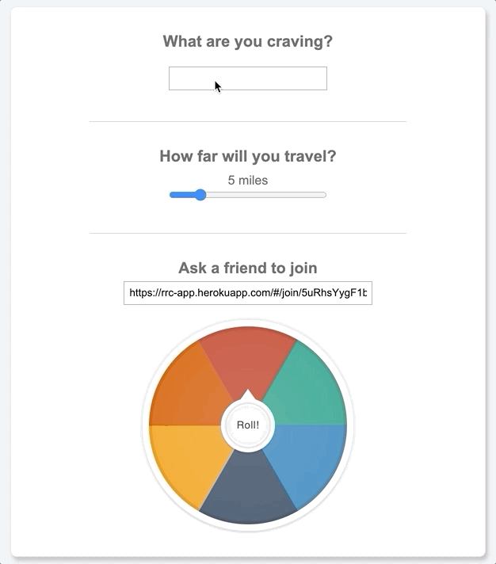

# RestaurantRoulette

A web application is here solving for "what should we eat for today?" base on login user's current location and different preference criteria, returning a list of potenital local food restaurnts that best matches user input, and saving user's accepted restaurant to the profile.    

[Wiki](https://github.com/LeoYulinLi/RestaurantRoulette/wiki) | [Live Demo](https://rrc-app.herokuapp.com/) 

## Technologies
* MongoDB
* Mongoose 
* Express.js
* React
* Node.js 
* SCSS 
* Yelp API 
* Google Map API
* Heroku deployment 

## Features 
* User Authentication 
* Yelp API integration 
* Randomized Selection 
* Restaurant History 
* Google Map API
* Group feature

### User Authentication 
* User can sign up an account and login, and the Demo login is allowing user to browse through the site and visited the list of past visited restaurants history wihout creating an account. 
* Using passport and JWT for authentication and validator for input validation.

### Randomized Selection 
Based on user's input preference, and use Yelp API to search for nearby restaurants. Restaurnt Roulette will randomly generate a match restaurant and user has option to choose accept or reroll.


### Restaurant History
A list of user's accepted restaurant saved in the profile page. 


### Live Chat
Live chat, allowing users to join the same room, and select a restaurant together.


## Code Snippets

### Custom Autocomplete Search Bar
Utilized React state, and a combination of event handlers to create a custom Search Bar complete with an autocomplete dropdown, and keyboard controlled inputs.
Using React state, the search bar will cross reference the user's input to our database of categories, and update the dropdown in real time.
Once the dropdown has been generated, the arrow keys have been bound using a keydown event listener to allow users to cycle through the suggestions.
Pressing enter on a highlighted suggestion will then select, and update the local slice of state, and display the selected category.



```javascript
<div className="autocomplete-container">
  <input
    className="autocomplete-input"
    value={categoryInput}
    onChange={e => setCategoryInput(e.target.value.toLowerCase())}
    onKeyDown={handleDropdown}
    onClick={() => toggleAutoCompleteDisplay('')}
  />

  <ul className={`autocomplete-dropdown-list ${autoCompleteDisplay}`}>
    {
      autoCompleteCategories.map( category => {
        let focus = '';
        if (category.alias === autoCompleteFocusId) focus = 'focus';
        return (
          <li
            id={category.alias}
            key={category.alias}
            className={`autocomplete-dropdown-item ${focus}`}
            onClick={handleDropdownClick(category)}
          >
            {`${category.title} (${category.alias})`}
          </li>
        )
      })
    }
  </ul>
</div>
```

### Accepting a Restaurant
The accept restaurant function doesn't accept a request body.
Instead, it uses a database entry which records the user's latest roll.
This prevents users from submitting a random yelp id into the database,
ensuring that group votes, when implemented, will be fair.
```javascript
router.post("/",
  passport.authenticate("jwt", { session: false }),
  async (req, res) => {
    const user = await User.findById(req.user.id);
    if (user.rolled_restaurant) {
        const history = new History({ user, yelp_id: user.rolled_restaurant });
        await history.save();
        await user.update({ $set: { rolled_restaurant: null }});
        res.json({ msg: "ok" });
    } else {
        res.status(400).json({ msg: "not rolled" });
    }
  }
);
```

### Filtering Restaurant History
Using React's state management, this code snippet filters the restaurant history based on which categories / prices have been selected.
```javascript
let filteredResults = [];
if (this.state.filters.length !== 0) {
  let numFilters = this.state.filters.length;
  for (let i = 0; i < this.props.restaurants.length; i++) {
    let numApplied = 0;
    let currentRestaurant = this.props.restaurants[i];
    for (let j = 0; j < this.state.filters.length; j++) {
      if (
        currentRestaurant.categories
          .map(category => category.title)
          .includes(this.state.filters[j]) ||
        currentRestaurant.price === this.state.filters[j]
      ) {
        numApplied += 1
      }
    } 
    if (numApplied === numFilters) {
      filteredResults.push(currentRestaurant);
    }
  }
} else {
  filteredResults = this.props.restaurants;
}
```